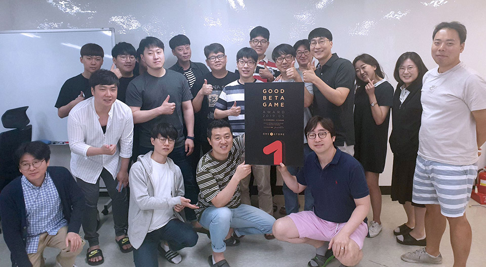
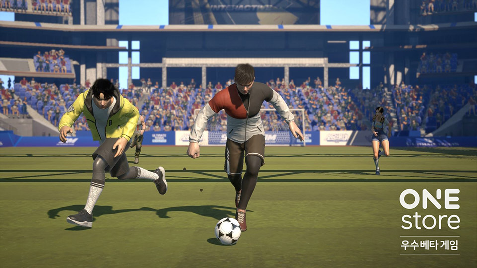

- **\- 12일부터 25일까지 14일간 6월 베타게임존 진행**
- **\- 6월 인디게임존 전시작 3종 공개**

(주)원스토어(대표: 이재환)는 (주)나인엠 인터랙티브(대표: 김성훈)의 '익스트림 풋볼'을 5월의 우수베타게임으로 선정했다고 밝혔다.

'익스트림 풋볼'은 지인들과 실시간 대전이 가능한 3:3 모바일 축구 게임으로 매력적인 그래픽, 사실적인 모션과 화려한 스킬, 모바일에서 아케이드 조작의 묘미를 잘 살렸다는 우수한 평을 받으며 원스토어 5월 우수베타게임으로 선정됐다.

(주)나인엠 인터랙티브의 김성훈 대표는 "베타 서비스 진행 전 '게임의 재미'와 '익스트림 풋볼'의 매력에 대한 고민이 많았으나 다행히 원스토어 베타게임존을 통해 지인과 함께 플레이 할 수 있는 축구 게임에 많은 공감을 해주시고, 재미있게 즐겨주셔서 감사하게 생각한다"며, "베타게임존에서 받은 피드백으로 보다 완성도 있게 개선해 앞으로 '익스트림 풋볼'이 모바일 축구 대표작이 될 수 있도록 개발하겠다"고 전했다.

(주)나인엠 인터랙티브는 스포츠 명가 EA 출신을 중심으로 스포츠를 좋아하는 개발자들이 모여 2014년 설립한 스포츠 전문 개발사이다. 전세계 2,000만 다운로드 이력이 있는 '얼티밋 테니스'를 서비스하며 뛰어난 기술력과 노하우를 인정받았다.

원스토어는 우수베타게임으로 선정된 '익스트림 풋볼'이 네이버 클라우드 혹은 SK C&C의 클라우드 제트를 사용할 경우 출시 전 클라우드 테스트 인프라 비용과 출시 당월과 익월까지 발생한 클라우드 인프라 비용을 무상으로 지원할 예정이다. 원스토어 우수베타게임 클라우드 비용 지원에 대한 보다 자세한 내용은 원스토어 개발자센터에서 확인 가능하다.

원스토어는 12일(수)부터 25일(화)까지 6월 베타게임존을 진행한다. 베타게임존 게임을 다운받아 플레이하고, 설문을 작성한 유저 중 게임 당 최대 100명에게 원스토어 게임 캐쉬 1만원을 제공한다.

또한, 6월 인디게임존 전시작으로 '킹덤 오브 레기온(오자크 소프트)', '리틀위치(아이들 게임즈)', '요정의 비밀옷장(레드캣)'을 전시하며 전시 기간 동안 해당 게임을 다운로드 할 경우 2,000원 상당 보상을 제공한다.
