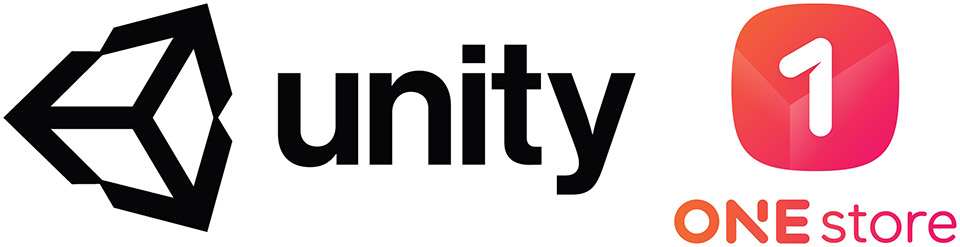

- **\- UDP로 모든 국내 앱스토어에 편리한 콘텐츠 출시 가능!**
- **\- 유니티 UDP 서비스 통해 원스토어에 별도의 SDK 통합 없이 콘텐츠 런칭 가능**
- **\- 유니티를 통해 전세계 앱스토어에 손쉬운 콘텐츠 출시 가능, 개발자 수익 창출 기대**

 세계적으로 가장 널리 사용되는 실시간 3D 개발 플랫폼을 제작하는 유니티 테크놀로지스(https://unity.com)가 대한민국 대표 앱스토어인 원스토어(ONE Store)와의 제휴를 통해 UDP(Unity Distribution Portal)의 국내 앱스토어 서비스를 개시한다고 밝혔다.

UDP는 세계 각지의 앱마켓 및 앱스토어 제휴를 통해 개발자들이 하나의 빌드만으로 여러 앱스토어에 콘텐츠를 자동 런칭할 수 있게끔 돕는 플랫폼 서비스다. 하나의 SDK만 탑재하면 UDP를 통해 앱마켓들에 콘텐츠 자동 등록이 가능해, 전세계 앱마켓을 대상으로 콘텐츠를 편리하게 출시할 수 있다.

원스토어는 게임 매출 국내 2위의 앱마켓으로 수익의 80%를 개발자에게 배분하고 있다. 통신사 멤버십 포인트 결제 등의 할인 혜택으로 인해 헤비게이머 비중이 높아 유니티 게임의 수익창출에 큰 도움이 기대된다. 개발자는 UDP서비스를 무료로 이용할 수 있으며, UDP를 통해 등록된 게임은 기존 원스토어 게임과 동일한 수수료율이 적용된다.  

김인숙 유니티 코리아 대표는 "우리나라의 대표 앱스토어인 원스토어와의 제휴를 통해 개발자들에게 더욱 다양한 성공의 기회를 제공할 수 있게 됐다"며, "앞으로도 전세계 각 지역의 앱스토어로 발을 넓혀갈 UDP 서비스에 많은 관심 부탁드린다"고 밝혔다.

원스토어(주) 이재환 대표는 "원스토어 미입점게임이 원스토어에 입점할 경우 다운로드는 10%, 매출은 20% 순증하게 된다"며, "글로벌 플랫폼인 UDP와의 협력을 통해 국내외의 더 많은 개발자들과 협업사례를 만들 수 있도록 노력하겠다"고 말했다.

한편 유니티는 올해 3월부터 UDP 오픈 베타 서비스를 시작하여 유니티 개발자에게 무료로 제공하고 있으며, 현재 중남미 및 중동 시장 기반의 앱스토어인 'Catappult' 및 동남아시아 시장 기반의 'Moo Store'와 제휴를 맺어 약 3억 명 가량의 이용자에 접근 가능한 플랫폼 서비스로 성장했다.
