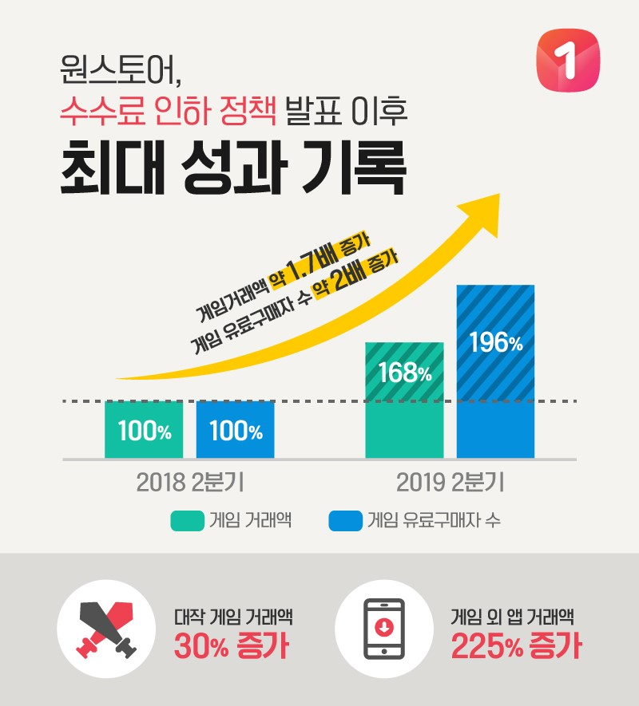

\- 수수료 인하 후 원스토어와 개발사 모두 주요실적 개선, 선순환 구조 안착

원스토어 주식회사(대표 이재환)는 지난해 수수료 인하 정책 발표 이후 대작 게임 입점 증가와 이로 인한 거래액 상승으로 역대 최고실적을 기록했다.

**□ 개발사에게 더 분배하면서도 거래액 증가와 함께 수익성 향상이라는 두 마리 토끼 잡아**

원스토어는 지난해 7월 4일, 앱 마켓 수수료를 기존 30%에서 20%로 낮추고, 자체 결제시스템을 적용한 경우에는 수수료를 5%까지 낮추는 파격적인 정책을 발표했다.

이후 1년 간 정책이 안정적으로 운영되며, 전체 앱/게임 생태계에서도 유의미한 변화가 일어나고 있다. 정책 발표 후 1년 동안, 수수료 인하로 인해 원스토어 수익성에 대한 우려의 시각이 존재했으나 개발사들이 적극적으로 원스토어에 입점, 마케팅에 집중하면서 원스토어 거래액이 큰 폭으로 증가해 수수료 하락을 상쇄하고 있다.

특히 정책발표 이후 대작 게임이 연이어 입점했다. ‘피파온라인4M(넥슨코리아)’, ‘삼국지M(이펀컴퍼니)’, ‘신명(준하이네트웍크)’, ‘오크(이펀)’를 시작으로 ‘검은강호(나인스플레이)’, ‘강림:망령인도자(준하이네트웍크)’, ‘왕이되는자(CHUANG COOL)’, ‘궁수의전설(Habby)’, ‘아르카(유엘유게임즈)’ 등이 현재 원스토어에 입점한 대표 대작 게임이다.

또한, 최근에는 구글플레이에서 ‘리니지M’에 이어 랭킹 2위를 차지한 ‘로한M(플레이위드)’이 원스토어에 입점해 흥행 돌풍을 일으키고 있다. 이런 대작 게임 입점에 힘입어 올해 2분기 원스토어의 유료 구매자수와 게임 거래액은 전년 동기 대비 각각 2배, 1.7배 증가했다. 이로 인해 월평균 매출도 크게 상승하면서 19년 상반기 원스토어 영업이익은 대폭 개선되었다.

이 같은 실적 상승은 대작 게임 타이틀의 거래액이 30% 이상 크게 늘어난 데 기인한 것으로 분석되며, 동영상 서비스 앱, 채팅앱 등의 게임 외 앱 거래액이 2.3배나 증가한 것도 한몫을 했다.

**□ 마켓-개발사-이용자 모두가 만족하는 선순환 구조의 안착**

원스토어는 정책 변경 발표 시, 마켓 수수료가 줄어도, 고객 혜택은 강화될 것이라고 밝힌 바 있다. 실제로 통신사 멤버십 할인을 통신 3사로 확대하였고, 다양한 쿠폰과 캐쉬백 등 할인 수단을 지속 제공해오고 있다.

또한 최근에는 자체 간편결제 서비스인 ‘원페이’에 은행계좌이체 옵션을 추가해 고객의 결제편의성을 한층 강화했다.

마켓 수수료 인하를 포함한 원스토어의 정책으로 인해 개발사의 수익 증대는 물론 고객의 혜택 확대, 그리고 원스토어의 실적개선이라는 선순환이 만들어지고 있다. 더 나아가 대규모 글로벌 회사들이 절대적 지위를 확보하고 있는 국내 앱/게임 시장의 판도에도 변화가 나타나고 있다.

앱 분석업체 모바일인덱스에 따르면 작년 연말 원스토어의 게임 거래액이 애플의 앱스토어를 추월하였고, 올해 5월에는 게임과 앱 거래액 포함된 앱 마켓 시장 점유율에서 원스토어가 애플 앱스토어를 앞지른 것으로 나타났다.

**□ 재투자를 통해 앱 생태계의 질을 높이는 노력 지속**

원스토어는 국내 시장을 넘어 글로벌 시장에서 경쟁력을 갖추기 위해 꾸준히 노력 중이며 조만간 가시적인 성과를 기대하고 있다. 국내 개발사들이 해외 시장으로 진출할 수 있는 활로를 모색하는 한편, 해외 개발사들의 국내 진출을 도와 국내 앱 생태계의 다양성과 확장성을 높여나갈 계획이다.

작년에 오픈한 삼성 갤럭시 스토어와의 협력 범위를 글로벌 시장으로 확장하는 방안을 추진하고 있고, 올해 6월에는 유니티테크놀로지스의 'UDP(Unity Distribution Portal)' 참여를 통해 하나의 빌드만으로 세계 여러 나라의 게임이 원스토어에 자동 출시되는 환경을 제공했다.

그리고 원스토어에 입점한 게임들이 해외에서도 쉽게 출시될 수 있도록 해외 통신사 및 단말 제조사들과의 전략적 제휴를 구체화하고 있다.

원스토어 이재환 대표는 “개발사에게 더 많은 수익을 배분하면서 고객들에게도 혜택을 확대하는 것이 쉽지 않았지만 개발사와 고객들이 적극 호응해주신 덕분에 좋은 성과를 거둘 수 있었고, 앞으로도 선순환이 지속 확장될 수 있도록 원스토어의 성장을 넘어 상생이라는 사회적 가치 창출에 일조하겠다”는 각오를 밝혔다.
