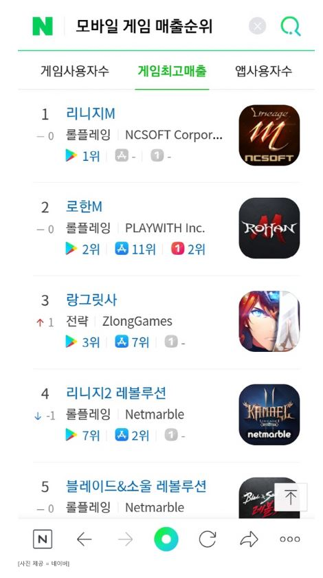

네이버는 검색 서비스를 통해 3대 앱마켓의 모바일 게임 통합 순위를 제공한다고 19일 밝혔다.

'모바일 게임 매출순위', '모바일 게임 순위'와 같은 검색어를 입력하면 구글플레이 스토어, 애플 앱스토어, 원스토어 등 국내 3대 앱마켓 매출 순위와 사용자 수 등의 정보를 확인할 수 있다.

순위 데이터는 데이터플랫폼 전문기업 아이지에이웍스가 집계한 모바일인덱스HD를 기반으로 한다.

김준영 네이버 게임 서비스 리더는 "게임 이용자와 개발사 모두 그동안 마켓별로 상이했던 순위 정보를 한 곳에서 보다 편리하게 확인할 수 있게 됐다"며 "특히 게임 개발사라면 특정 플랫폼에 제한되지 않고 보다 적극적으로 게임을 알릴 수 있을 것"이라고 말했다.

네이버는 앞으로 모바일 게임판, 게임 정보 페이지 등을 통해 통합순위 등 다양한 통계 정보를 제공할 계획이다.
