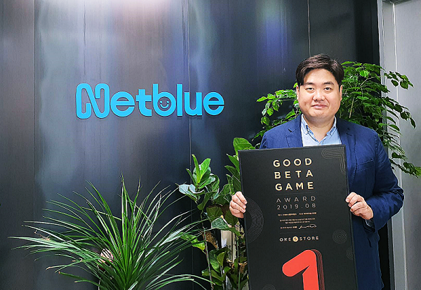

㈜원스토어(대표: 이재환)은 넷블루게임즈(대표: 박미란)의 ‘미르의 전설2 어게인’을 8월의 우수베타게임으로 선정했다고 밝혔다.

‘미르의 전설2 어게인’은 원작 ‘미르의 전설2’에 가까운 익숙한 그래픽을 갖췄으며, 자유로운 PK(Player Killing)와 1:1 거래, 공성전 등 다양한 콘텐츠를 보유하고 있다는 우수한 평을 받으며 원스토어 8월 우수베타게임으로 선정됐다.

넷블루게임즈 박미란 대표는 “원작의 느낌을 완벽하게 재현함과 동시에 모바일 게임에 최적화된 다양한 콘텐츠를 추가한 부분과 철저한 현지화 작업에 높은 점수를 주신 것 같다”며, “앞으로도 성원에 보답하기 위해 더욱 재미있는 게임을 서비스할 수 있도록 최선을 다하겠다”고 전했다.

넷블루게임즈는 올해 설립된 신생 퍼블리셔로 ‘삼국지 거상전’, ‘청량’, ‘미르의 전설2 어게인’을 연이어 론칭하며 한국 모바일게임 시장에서 두각을 나타내고 있다.

원스토어는 우수베타게임으로 선정된 ‘미르의 전설2 어게인’이 네이버 클라우드 혹은 SK C&C의 클라우트 제트를 사용할 경우 출시 전 클라우드 테스트 인프라 비용과 출시 당월과 익월까지 발생한 클라우드 인프라 비용을 무상으로 지원할 예정이다. 원스토어 우수베타게임 클라우드 비용 지원에 대한 보다 자세한 내용은 원스토어 개발자센터에서 확인 가능하다.

원스토어는 16일(월)부터 25일(수)까지 9월 베타게임존을 진행한다. 베타게임존 게임을 다운받아 플레이하고, 설문을 작성한 유저 중 게임 당 최대 100명에게 원스토어 게임 캐쉬 1만원을 제공한다.

또한, 9월 인디게임존 전시작으로 ‘아쿠아팡(라온엔터테인먼트)’, ‘육즙슬라이스(블랙스푼게임즈)’, ‘데몬 슬레이어 – 방치형 RPG(엔트로피)’를 전시하며 전시 기간 동안 해당 게임을 다운로드 할 경우 2,000원 상당 보상을 제공한다.

**\[참고\_베타게임존\]**

원스토어가 2016년 6월부터 운영 중인 대표적 중소게임사 지원프로그램 ‘베타게임존’은 원스토어가 모집한 사용자들이 직접 베타버전 게임을 플레이한 뒤, 소감 및 개선의견을 내는 서비스이다. 베타게임존 지원을 받은 ‘아덴(이츠게임즈-1위)’, ‘아케론(넥스트무브-10위이내)’, ‘녹스(녹스게임즈-20위이내)’ 등은 정식 오픈에서도 대형 게임들을 능가하는 좋은 실적을 거두었다.
