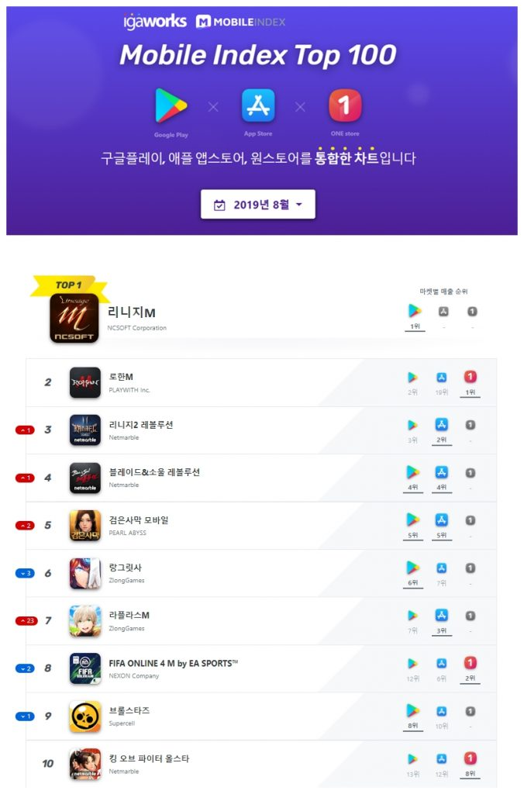

\- 모바일인덱스 8월의 3사 통합 모바일 게임 랭킹 발표 - 3대 앱마켓 동시 출시 이후 ‘로한M’ 인기 이어가며 2위 차지 - ‘브라운더스트’, ‘삼국지디펜스M’, ‘갓수라:운명을 지배하는 자’ 80계단 이상 급상승하며 인기몰이

모바일 앱마켓 간의 경쟁이 치열해지며 각 마켓 별 게임 순위 외에 통합 랭킹에 대한 관심이 높아지고 있다. 지금까지 모바일 게임 랭킹을 보려면 각 앱마켓의 순위를 확인하는 방법 밖에 없었으나 이제는 한 곳에서 3대 마켓의 성과가 반영된 통합 랭킹을 볼 수 있다. 이에 모바일인덱스는 앱마켓 3사의 8월 모바일 게임 매출을 기준으로 한 통합 랭킹 차트를 발표했다.

1위는 NC소프트의 ‘리니지M’으로 3개 마켓 중 구글플레이에만 입점해 단일 마켓 매출임에도 불구하고, 2019년 1월 이후 부동의 선두를 달리고 있다.

3개 마켓에 모두 입점한 게임 중에서는 플레이위드의 대작게임 ‘로한M’이 가장 높은 순위인 2위를 차지했다. 지난 6월 출시하자마자 높은 인기를 끌고 있는 ‘로한M’은 특유의 콘텐츠인 타운공방전, 공성전 등 다수간 대결에 초첨을 맞추며 유저들이 선호하는 요소로 인기몰이 중이다.

전월 대비 급상승한 게임도 눈에 띈다. 56위의 네오위즈의 ‘브라운더스트’는 100위권 밖에 있던 7월에 비해 88계단이나 상승하였고, 특히 아이클럭워크의 ‘삼국지디펜스M’과 이스카이펀 엔터테인먼트의 ‘갓수라:운명을 지배하는 자’는 전월 대비 각 184계단, 158계단 큰 상승폭을 기록하며 각 76위와 85위로 100위권에 진입했다.   

3사의 통합 랭킹에서만 확인할 수 있는 결과도 눈길을 모은다. 넥슨의 ‘피파 온라인 4M’과 넷마블의 ‘킹 오브 파이터 올스타’의 경우 구글플레이에서는 12위, 13위로 10위권 밖으로 밀려났지만, 원스토어에서 각 2위, 6위의 매출을 기록하며 통합 랭킹 8위와 10위에 랭크했다.

10위권 밖에서도 16위 이펀컴퍼니의 ‘삼국지M’, 21위 준하이네트워크의 ‘신명’, 29위 스마트조이의 ‘라스트오리진’은 구글플레이와 애플 앱스토어에서 기존보다 순위가 많이 내려갔지만 원스토어에서 선방하여 통합 랭킹 상위 그룹을 유지하였다.

한편, 통합 랭킹은 데이터플랫폼 전문기업 아이지에이웍스가 집계한 모바일인덱스HD를 기반으로 제공되며, 네이버 모바일 버전에서 ‘모바일 게임 순위’를 검색하거나 모바일인덱스 [http://www.mitop100.com](http://www.mitop100.com) 와 페이스북을 통해 확인할 수 있다.
