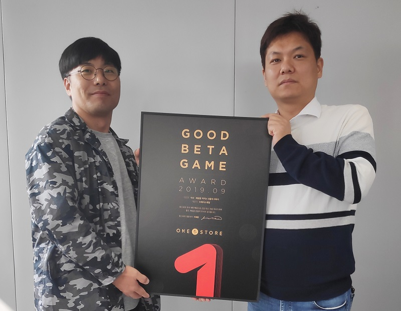

\- 14일부터 25일까지 12일간 10월 베타게임존 진행 - 10월 인디게임존 전시작 3종 공개

**(Press Release 2019년 10월 16일)**

㈜원스토어(대표: 이재환)은 위더스게임(대표: 최재호)의 ‘사신 : 세상을 지키는 신들의 이야기’를 9월의 우수베타게임으로 선정했다고 밝혔다.

‘사신 : 세상을 지키는 신들의 이야기’는 순수 국내 기술력을 바탕으로 ㈜스톰게임즈에서 제작하고, ㈜위더스게임에서 서비스하는 동양 판타지 MMORPG 장르의 게임이다. 3D 고퀄리티 그래픽을 기반으로 장비 강화와 승급, 코스튬, PK(Player Killing) 등 다양한 콘텐츠를 보유하고 있다는 평을 받으며 원스토어 9월 우수베타게임으로 선정됐다. ‘사신 : 세상을 지키는 신들의 이야기’는 현재 원스토어에 정식으로 출시되어 다운로드([https://onesto.re/0000742795](https://onesto.re/0000742795)) 가능하다.

위더스게임 최재호 대표는 “‘사신 : 세상을 지키는 신들의 이야기’를 많은 분께서 관심을 가져주시고, 베타 게임에 참여해주셔서 대단히 감사드린다”며, “론칭 이후에도 유저들의 의견을 귀담아 운영에 최선을 다하고, 베타 게임 때부터 받은 유저들의 관심에 더 많은 콘텐츠와 이벤트로 보답하겠다”고 전했다.

위더스게임은 유저를 위한 게임을 생각하고 서비스하겠다는 가치관 아래, 2016년부터 설립된 퍼블리셔로 ‘아이들 히어로즈’ 등 다수의 게임 서비스에 기반한 풍부한 퍼블리싱 노하우를 보유하고 있다.

원스토어는 우수베타게임 대상으로 네이버 클라우드, SK C&C의 클라우트 제트를 사용할 경우 출시 전 네이버 클라우드 테스트 인프라 비용과 출시 당월과 일월까지 발생한 클라우드 인프라 비용을 무상으로 지원한다.

이달 선정된 ‘사신 : 세상을 지키는 신들의 이야기’는 네이버 클라우드 적용을 위해 발생된 인프라 비용을 원스토어로부터 지원받는다. 원스토어 우수베타게임 클라우드 비용 지원에 대한 보다 자세한 내용은 원스토어 개발자센터에서 확인 가능하다.

원스토어는 14일(월)부터 25일(금)까지 10월 베타게임존을 진행한다. 베타게임존 게임을 다운받아 플레이하고, 설문을 작성한 유저 중 게임 당 최대 100명에게 원스토어 게임 캐쉬 1만원을 제공한다.

또한, 10월 인디게임존 전시작으로 ‘드랍더좀비(레벨9)’, ‘귀혼 : 소탕 RPG(퍼니글루)’, ‘드래곤 아일랜드(젤리핍)’를 전시하며 전시 기간 동안 해당 게임을 다운로드 할 경우 2,000원 상당 보상을 제공한다.

\# # #

**\[참고\_베타게임존\]**

원스토어가 2016년 6월부터 운영 중인 대표적 중소게임사 지원프로그램 ‘베타게임존’은 원스토어가 모집한 사용자들이 직접 베타버전 게임을 플레이한 뒤, 소감 및 개선의견을 내는 서비스이다. 베타게임존 지원을 받은 ‘아덴(이츠게임즈-1위)’, ‘아케론(넥스트무브-10위이내)’, ‘녹스(녹스게임즈-20위이내)’ 등은 정식 오픈에서도 대형 게임들을 능가하는 좋은 실적을 거두었다.
