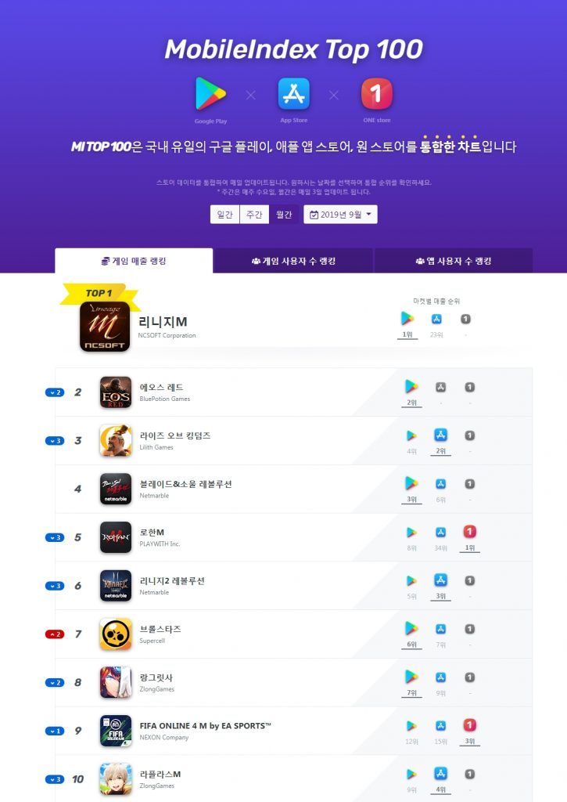

\- ‘미르의 전설2 어게인’ 8월 말 출시 이후 368계단 급상승

\- ‘삼국지:략’, ‘보스레이브’ 90계단 이상 오르며 100위권 진입

**(Press Release 2019년 10월 23일)**

3대 모바일 앱마켓의 게임 랭킹 순위를 발표하는 모바일인덱스에서 게임 매출을 기준으로 한 9월 모바일 게임 통합 랭킹 차트를 발표했다.

1위는 지난달과 변동 없이 NC소프트의 ‘리니지M’이 차지했다. 10위권 내에서는 슈퍼셀의 ‘브롤스타즈’만 2계단 올라 순위 상승을 기록했다.

전월 대비 순위가 급상승한 게임은 넷블루게임즈의 ‘미르의 전설2 어게인’이다. ‘미르의 전설2 어게인’은 368계단이라는 급격한 상승세로 37위를 기록하며 100위권에 진입했다. 원작 ‘미르의 전설2’의 느낌을 완벽하게 재현한 익숙한 그래픽과 다양한 콘텐츠를 강점으로 가진 ‘미르의 전설 2 어게인’은 원스토어에서 지난 8월 우수베타게임으로 선정된 이후, 구글플레이와 원스토어에서 동시 출시되었다.

이 밖에도 유주게임즈코리아의 ‘삼국지:략’이 127계단, 룽투코리아의 ‘보스레이브’가 94계단을 오르며 각각 64위, 35위로 100위권 내에 진입했다.

3사 통합 랭킹만의 유의미한 결과도 나타났다. 플레이위드의 ‘로한M’은 구글플레이와 애플앱스토어에서 각각 8위와 34위를 기록했지만 원스토어에서 1위의 매출을 기록하며 통합랭킹 5위라는 높은 순위를 기록했다. 이펀컴퍼니의 ‘삼국지M’ 역시 구글플레이 64위를 기록했으나 원스토어에서 4위를 차지해 통합 랭킹 15위에 올랐다.

10월 중순부터 원스토어에 출시해 3개 앱마켓에 모두 입점하게 된 펄어비스의 ‘검은사막 모바일’(11위)과 넥슨의 ‘트라하’(53위) 역시 다음달 순위에 변동을 이끌 것으로 기대된다.

한편, 모바일인덱스는 월간으로 확인할 수 있던 게임 매출 랭킹을 일간과 주간까지 한 페이지에서 확인할 수 있도록 개편했다. 통합 랭킹은 데이터플랫폼 전문기업 아이지에이웍스가 집계한 모바일인덱스HD를 기반으로 제공되며, 네이버 모바일 버전에서 ‘모바일 게임 순위’를 검색하거나 모바일인덱스([http://www.mitop100.com](http://www.mitop100.com))에서 확인할 수 있다.
