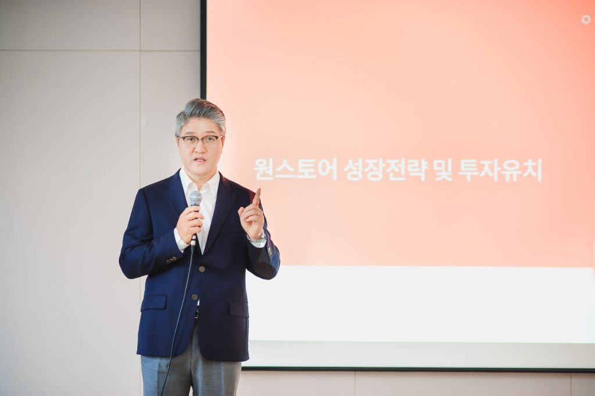

\- 최근 5개분기 연속성장을 통해 거래액 2배 성장 - 기업 가치 5천억원으로 평가, 예비 유니콘 반열 등극

\- 초대형 게임 유치를 통해 2022년 게임시장 점유율 30%까지 확대

원스토어 주식회사(대표 이재환)는 6일 서울 중구 SK텔레콤 기자실에서 기자간담회를 열고 1,000억원 규모의 투자 유치 소식과 함께 선두 사업자와의 대등한 경쟁구도 형성을 위해 공격적으로 전략으로 성장을 가속화하겠다고 발표했다.

원스토어는 작년 7월, 모바일 앱마켓의 불문율로 통하던 30%의 마켓수수료를 20%로 낮추고 개발사 자체결제 수단도 수용하는 등 파격적 정책 변경을 단행했다. 이후 높은 수익률에 대한 기대로 원스토어에 입점하는 게임이 대폭 늘어나면서 원스토어의 게임 거래액은 18년 3분기부터 19년 3분기까지 5개 분기 연속 성장하였고, 2018년 말부터는 애플 앱스토어를 추월, 2위 사업사업자로 자리잡았다. 이러한 성장에 힘입어 2019년 상반기에는 흑자 전환에도 성공하여 수익성 측면에서도 큰 개선을 이루기도 했다. 이번 투자를 결정한 투자자들 역시 최근 보여준 성장세와 수익성 개선을 높이 평가한 것으로 알려졌다.

투자사 키움인베스트먼트와 SK증권이 참여한 이번 투자로 원스토어 기존 주주인 SK텔레콤과 네이버가 각각 52%, 28%의 지분을, 신규투자자가 설립한 사모펀드가 20%의 지분을 보유하게 되었다. 특히 이번 투자를 통해 원스토어는 기업 가치를 5천억원으로 평가 받으며 ‘예비 유니콘’ 반열에 올라섰다.

**■ 모바일게임 시장점유율 30%까지 조기 확대를 위해 초대형 게임 유치에 총력**

모바일 게임 시장은 2018년부터 PC 게임 시장규모를 추월하여 지속 성장하고 있으며, ‘리니지’에 이어 ‘디아블로’나 ‘리그 오브 레전드’ 등 초대형 PC 온라인 게임의 IP(지적재산권)를 기반으로 한 모바일 게임의 출시가 1~2년 내 본격화될 것으로 예상된다.

원스토어는 국내외 초대형 IP 모바일게임이 집중 출시될 올해 말부터 내년까지 ㅇ초기 집객마케팅 지원, ㅇ전략적 투자, ㅇ통신사 역량 레버리지 등 가용한 모든 자원을 총동원하여 주요 게임들을 유치할 계획이다. 이를 바탕으로 원스토어는 2022년 게임시장에서의 점유율을 30% 이상 수준으로 대폭 끌어올릴 예정이다.

**■ 게임유저들이 즐겨 찾는 게임 플랫폼으로서의 완결성 강화**

원스토어는 게임을 단순 다운로드만 하는 마켓을 넘어서, 모바일 e-스포츠와 게임영상 스트리밍 서비스는 물론 게임 기어 (Gear) 및 굿즈 (Goods) 판매까지 게임을 하는 사람들에게 필요한 서비스를 추가할 예정이다. 이를 통해 게임 유저들이 즐겨 찾고 많은 시간을 보내는 게임 플랫폼으로 자리매김할 계획이다. 이러한 계획의 효과적인 실현을 위해 세계 최고 수준의 e스포츠 전문 구단 ‘T1’과 시너지를 낼 수 있도록 선수단 후원을 시작하였으며, 향후 다양한 형태로 협력을 이어나갈 계획이다.

**■ 원스토어의 성공 모델을 글로벌 시장으로 확산**

원스토어는 국내 시장에서의 성장을 가속화하는 것과 병행하여 원스토어의 사업모델을 해외로 확산해 나갈 방침이다. 이를 위해 해외에서 구글플레이와 경쟁 중인 다수의 사업자들과의 연대를 주도할 계획이며, 현재 동남아와 유럽 지역의 유력 통신사들과 JV 설립을 비롯한 협력을 논의 중이며, 자체 앱마켓을 운영 중인 단말제조사들과도 논의를 구체화하고 있다. 원스토어가 다년간 개발하여 운영 중인 앱마켓 사업의 핵심기술을 제휴에 참여하는 업체들과 공유하여 서로의 생태계를 연결하고 확장해가는 방식이다.

원스토어가 추진하는 글로벌 제휴가 성사되면 가상적인 하나의 글로벌 앱마켓이 만들어지게 되어게임업체들은 단일 버전의 게임을 가지고 다수의 글로벌 마켓에 게임을 출시하여 더 많은 수익을 거둘 수 있게 된다. 게임 이용자들도 각각의 앱마켓에서 출시되는 게임을 넘어 공동으로 소싱된 다양한 게임을 즐길 수 있게 된다. 이 같은 원스토어의 글로벌 행보는 회사의 성장은 물론, 게임 생태계 확장에도 중요한 역할을 할 것이라 전망된다.

**■ 스토리콘텐츠 사업 본격 육성해 IP 경쟁력 확보**

한편, 원스토어는 트랜스미디어의 추세 속에 게임은 물론 드라마와 영화의 원천 소재로 주목을 받고 있는 웹소설과 웹툰 사업을 본격 육성할 계획이다. 원스토어는 일반도서 e북을 시작으로 웹소설과 웹툰 등 스토리콘텐츠 전반으로 영역을 확대하였는데 금번 투자유치를 계기로 퍼블리싱, 플래폼 제휴 등을 통해 콘텐츠를 대폭 확충하고, 월정액 구독형 사업모델을 강화할 계획이다.

원스토어 이재환 대표는 "지난해 수수료를 인하하는 과감한 결정을 통해 국내 모바일앱 시장에 “상생”이라는 화두를 던진 이후 괄목할 성장을 보이며 가능성을 보여주었다”며 “이번 투자 유치를 기점으로 성장에 더 박차를 가하여 원스토어와 더불어 생태계 전체가 성장, 발전하는 진정한 상생 플랫폼의 모델을 만들어 가겠다”고 각오를 밝혔다
