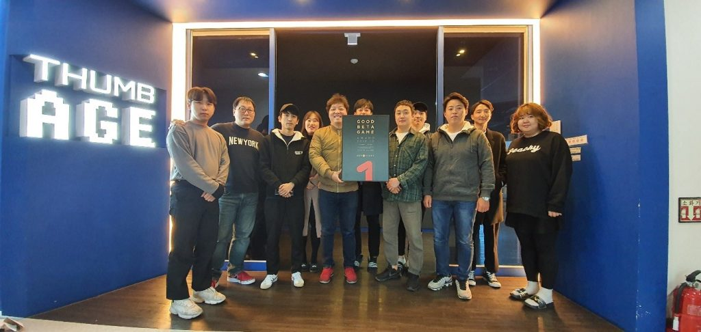

\- 12일부터 25일까지 14일간 11월 베타게임존 진행 - 11월 인디게임존 전시작 3종 공개

원스토어㈜(대표: 이재환)은 ㈜썸에이지(대표: 박홍서)의 ‘진화소녀’를 10월의 우수베타게임으로 선정했다고 밝혔다.

‘진화소녀’는 역사 속 위인들의 DNA로 재탄생한 캐릭터 50여 종이 등장하는 독특한 설정의 수집형 모바일 게임이다. 좀비 사태가 터진 세계의 인류를 구하는 스토리로 다양한 전투 콘텐츠가 특징이다. 또한, 자신의 기지를 꾸미고 육성할 수 있는 하우징 시스템으로 유저 각각의 개성을 뽐내는 것은 물론 친구, 길드원과 활발한 커뮤니케이션이 가능하다.

㈜썸에이지 박홍서 대표는 "원스토어 10월의 우수베타게임에 선정해 주신 것에 감사드린다"며 "정식 출시에는 더욱 많은 캐릭터와 콘텐츠로 성원에 보답할 것"이라고 소감을 밝혔다.

**\[참고\_베타게임존\]**

원스토어가 2016년 6월부터 운영 중인 대표적 중소게임사 지원프로그램 ‘베타게임존’은 원스토어가 모집한 사용자들이 직접 베타버전 게임을 플레이한 뒤, 소감 및 개선의견을 내는 서비스이다. 베타게임존 지원을 받은 ‘아덴(이츠게임즈-1위)’, ‘아케론(넥스트무브-10위이내)’, ‘녹스(녹스게임즈-20위이내)’ 등은 정식 오픈에서도 대형 게임들을 능가하는 좋은 실적을 거두었다.
