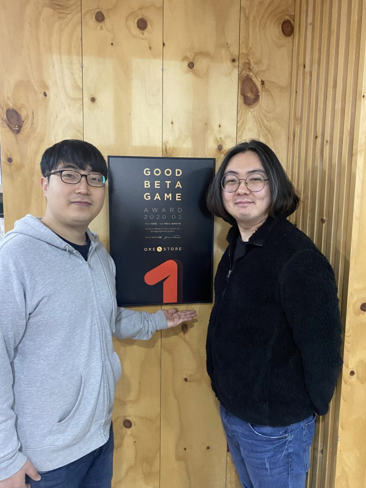

\- 3월 12일부터 25일까지 14일간 베타게임존 진행

\- 3월 인디게임존 전시작 3종 공개

원스토어㈜(대표: 이재환)은 ㈜블루솜의 ‘야생소녀 - 잃어버린 낙원’을 2월의 우수베타게임으로 선정했다고 밝혔다.

이달 선정된 '야생소녀 - 잃어버린 낙원'은 풍부한 시나리오를 기반으로 한 미소녀 RPG 게임이다. 나만의 미소녀 캐릭터와 함께 다양한 전략을 수립해 즐길 수 있도록 턴제 전투를 도입한 것이 특징이다.

송호진 ㈜블루솜 대표는 "미소녀 게임의 본질적인 가치에 충실하고자 캐릭터 일러스트에 많은 시간을 투자했다”고 전하며 “미소녀 캐릭터성을 잘 살리는 등 서브컬처 유저들에게 좋은 작품으로 다가가고자 많은 노력을 기울였다"고 덧붙였다.

㈜블루솜은 2005년 8월 부산에서 설립된 게임 전문 개발사이다. 2016년 첫 모바일 게임 ‘창공의수호자’ 서비스를 시작으로 미소녀 RPG 게임 전문 개발사의 입지를 탄탄히 다지고 있다.

원스토어가 선정한 우수베타게임은 네이버 클라우드, SK C&C의 클라우드 제트를 사용할 경우 게임 출시 전 클라우드 테스트 인프라 비용과 출시 당월과 익월까지 발생한 클라우드 인프라 비용을 무상으로 지원받을 수 있다. 보다 자세한 내용은 원스토어 개발자 센터에서 확인할 수 있다.

원스토어는 12일(목)부터 25일(수)까지 14일동안 3월 베타게임존을 진행한다. 유저가 베타게임존 게임을 다운로드해 플레이 후 설문을 작성하면 게임당 최대 100명에게 원스토어 게임 캐쉬 1만원을 제공한다.

또한, 3월 인디게임존 전시작 3종인 ‘고스트시그널’(라온엔터테인먼트), ‘캣트릭스’(리브라시스템스), ‘마인킹덤’(SOFTCHIPS)을 전시한다. 전시 기간 동안 해당 게임 다운로드 시 2,000원 상당 보상이 제공된다.

\# # #

**\[참고\_베타게임존\]**

원스토어가 2016년 6월부터 운영 중인 대표적 중소게임사 지원프로그램 ‘베타게임존’은 원스토어가 모집한 사용자들이 직접 베타버전 게임을 플레이한 뒤, 소감 및 개선의견을 내는 서비스이다. 베타게임존 지원을 받은 ‘아덴(이츠게임즈-1위)’, ‘아케론(넥스트무브-10위이내)’, ‘녹스(녹스게임즈-20위이내)’ 등은 정식 오픈에서도 대형 게임들을 능가하는 좋은 실적을 거두었다.
