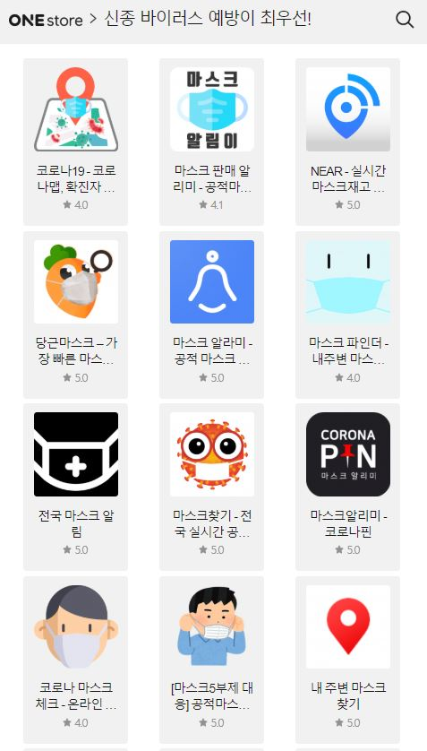

\- 코로나19 관련 앱 모아놓아 쉽고 빠르게 검색 및 다운로드 가능

\- 원스토어 게임 인기·최고매출 부문 1위 ‘카오스모바일’ 차지

\- 웹소설 ‘오!나의 하녀님’ 인기에 힘입어 단행본으로도 출간 

게임, 앱, 스토리 콘텐츠까지 다양한 모바일콘텐츠를 서비스하는 앱마켓 원스토어가 최근 한 달간의 주요 신작 및 프로모션 소식을 전한다.

원스토어는 최근 확산되고 있는 코로나19 사태로 국민 불안이 늘어나는 가운데, 유용한 정보를 신속하게 제공하고자 ‘신종 바이러스, 예방이 최우선’ 신규 섹션을 앱 메인 화면에 배치하고, 코로나19 정보 앱을 신속하게 검색되도록 조치했다.

현재 원스토어 앱의 해당 섹션([http://onesto.re/CRD0050264)에](http://onesto.re/CRD0050264)에) 접속하면 ‘코로나맵-코로나알리미’, ‘코백-코로나100m 알리미’와 같은 예방 앱과 ‘똑닥’, ‘마스크 알리미’와 같이 마스크 정보 앱을 한눈에 모아볼 수 있다. 또한 행정안전부 ‘안전디딤돌’, 경상남도 도청에서 자체 개발한 ‘코로나19 경남’ 등 정부 및 지자체에서 제공하는 정보 앱까지 확인이 가능하다.

원스토어는 이용자들이 찾는 앱을 쉽게 다운로드 할 수 있도록 ‘코로나’ 키워드에 대한 검색을 별도로 제한하지 않고 다운로드를 권고하되, 부적절한 목적의 앱에 대한 철저한 모니터링 및 신속한 대응을 이어나갈 예정이다.

원스토어 이재환 대표이사는 "최근 코로나19 국면이 장기화되면서 다양한 관련 앱들이 등장하고 있다. 원스토어는 한국을 대표하는 앱마켓으로서 공신력 있는 데이터를 기반으로 만들어진 앱들을 선별하여 국민들이 코로나19 관련 정보를 유용하게 활용하실 수 있도록 최선을 다할 것”이라고 전했다.

게임 분야에서는 지난 2월 채플린게임의 ‘쓰리킹덤즈M’, 준하이네트워크의 ‘검무’, 엑스엔게임즈의 ‘카오스모바일’ 서비스를 시작하며 유저들에게 좋은 반응을 얻고 있다. 이 중 ‘카오스모바일’은 인기 게임 '카오스 온라인'의 영웅들을 재탄생시킨 모바일 MMORPG로 출시와 동시에 인기몰이 중이다. 원스토어에서는 지난 4일 기준 인기·최고매출 1위를 차지했다.

이 밖에도 원스토어는 모바일 게임 유저를 위한 ‘날마다 혜택체크’ 상시 프로그램을 통해 평일 5%, 주말 10%의 게임 할인 쿠폰과 원데이에는 1,000게임 캐쉬를 제공하며, 캐쉬백, 시즌 이벤트, 경품 이벤트 등을 진행 중이다.

스토리 콘텐츠 분야에서는 로맨스, 판타지 등 다양한 장르의 웹소설, 웹툰이 이용자들에게 사랑받고 있다. 특히, 웹소설 ‘재벌가 차남은 먼치킨(작가 말리브해적)’은 재벌가의 막내가 주인공이라는 캐릭터 설정과 회귀물 클리셰를 게임 판타지를 배경으로 한 참신한 세계관으로 펼쳐나가며 인기리에 연재, 원스토어북스 2월 판타지 소설 부문 랭킹 4위까지 올랐다.

또한 원스토어가 지난해 주최한 ‘제3회 대한민국 창작소설 공모대전’ 대상 수상작 ‘오!나의 하녀님(작가 봄온다)’이 3월 전자책 단행본으로 출간될 예정이다. 지난 2월 10일까지 원스토어 북스 스튜디오를 통해 연재되었으며, 2월 원스토어북스 웹소설 로맨스판타지 부문 월간 랭킹 1위에 오를 정도로 구독자들의 사랑을 받은 작품으로 단행본 역시 많은 인기가 예상된다.
