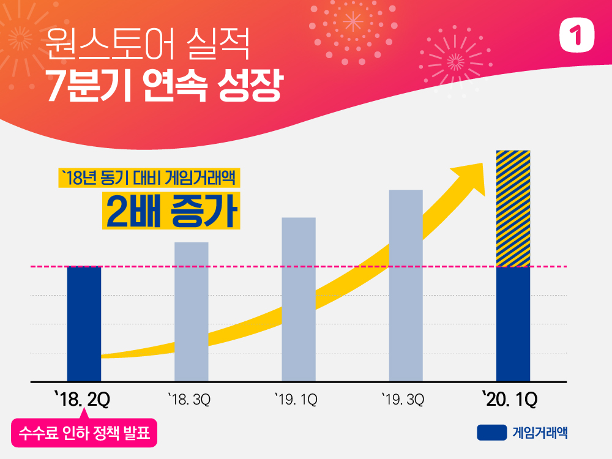

\- 게임거래액 2년 만에 2배 성장, 모바일게임 대표 마켓으로 자리매김 - 수수료 인하로 현재까지 약 460억원의 개발사 추가수익 발생

원스토어 주식회사(대표 이재환)가 올해 1분기 역대 최고 실적을 갱신하며 2018년 2분기 이후 7분기 연속 게임 거래액 성장을 이어갔다.

2018년 7월 개발사와의 상생을 목적으로 기존 30%에서 최대 5%까지 수수료를 전격 인하한 이후, 올해 1분기 원스토어의 게임 거래액은 수수료 인하 이전인 2018년 동기 대비 약 2배 증가했다. 모바일 빅데이터 분석기업 아이지에이웍스 모바일인덱스에 따르면 원스토어의 지난해 국내 마켓별 모바일게임 매출 점유율은 12.2%로 애플 앱스토어를 제치고 2위를 차지하는 등 꾸준한 성장세를 기록 중이다.

원스토어는 수수료 인하 정책 이후 입점한 넥슨의 ‘피파 온라인 4M’, 4399코리아의 ‘기적의 검’, 플레이위드의 ‘로한M’, 스마트조이의 ‘라스트오리진’ 등이 이용자들에게 꾸준히 인기를 얻으며 게임거래액 상승을 견인한 것으로 분석했다. 특히, 올해 입점한 엑스엔게임즈의 ‘카오스모바일’은 사전예약 60만명 돌파라는 놀라운 기록을 세우며 출시와 동시에 1분기 대표 흥행 게임으로 자리잡았다.

7분기 연속 성장이라는 기록은 외산 앱마켓에 비해 대형게임 입점율이 낮은 열세를 이겨내고 일궈낸 성과라는 점에서 의의가 크다. 모바일인덱스가 3대 앱마켓 게임 매출을 기준으로 발표하는 모바일게임 통합 랭킹 차트를 살펴보면 올해 1월 랭킹 20위 내 게임 중에서 원스토어에는 ‘피파 온라인 4M’, ‘기적의 검’, ‘샤이닝라이트’, ‘원조이 포커’, ‘왕이되는자’, ‘검은사막 모바일’, ‘뇌명천하’, ‘피망 포커’, ‘달빛 조각사’ 등 총 9개만 입점한 상황이다. 현재 원스토어가 공을 들이고 있는 대형게임의 입점이 늘어날 경우 현재의 성장 추세는 더욱 가속화될 것으로 기대하고 있다.

원스토어의 성장은 개발사와의 동반 성장이라는 사회적 가치를 실현하면서 이룬 성과라는 점에서도 의미가 크다. 외산 앱마켓이 수수료 30% 정책을 고수하는 동안 원스토어가 추진한 수수료 인하 정책으로 게임 및 앱 서비스 회사들이 추가로 얻게 된 수익은 7분기 동안 약 460억원에 달한다. 

외산 앱마켓에 비해 이용자들에게 다양한 혜택을 제공하는 차별화 요소도 원스토어의 성장을 견인하는 데 한몫을 한 것으로 분석된다. 원스토어는 매일 게임 유저에게 새로운 혜택을 제공하는 ‘날마다 혜택체크’, 통신 3사 멤버십 할인 및 캐쉬백 혜택과 함께 다양한 결제 수단을 제공하고 있다. 이 결과, 원스토어는 경제 혹한기라는 올해 1분기 최고 거래액을 갱신하였고 이 덕분에 영업이익도 흑자를 기록, 성장성과 함께 수익성을 개선하는 성과를 거두었다.

2020년 원스토어는 해외 통신사 및 단말 제조사 등과의 연대를 통해 글로벌 시장에도 한 발 나아갈 계획이다. 또한 스토리콘텐츠 분야에서도 월정액 북패스를 운영하고, 드라마나 영화의 원천 소재로 각광받고 있는 웹툰·웹소설 IP를 적극적으로 확보하는 등 새로운 성장 동력을 지속적으로 육성해갈 방침이다.

원스토어 이재환 대표이사는 “원스토어는 시장 친화적인 정책을 기반으로 새로운 앱마켓 바람을 불러일으키고 있으며, 이 과정에서 좋은 실적까지 달성하게 되었다”며 “앞으로도 지속적인 성장을 통해 개발사와 이용자 모두에게 더 많은 혜택을 주는 기업으로 성장하겠다”고 전했다.
