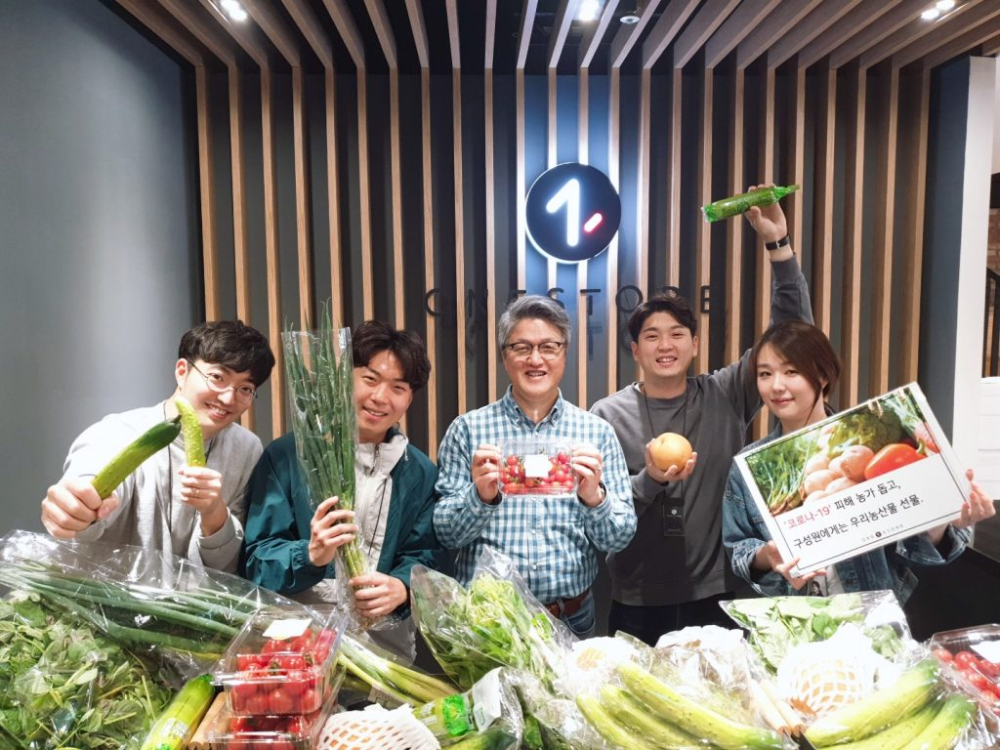

\- 개학 연기로 어려움 겪는 경기도 학교급식용 농산물 재배 농가 돕기 참여 - 200개 농산물 꾸러미 구매해 전 직원에게 전달

국내 앱마켓 원스토어 주식회사(대표 이재환)가 코로나19로 어려움을 겪고 있는 지역 사회를 위해 경기농식품유통진흥원의 ‘코로나19 농가돕기’ 프로젝트에 참여했다.

경기농식품유통진흥원에서 진행하는 ‘코로나19 농가돕기’ 프로젝트는 코로나19로 학교급식이 중단되어 어려움을 겪고 있는 친환경급식용 농산물 재배 농가를 돕기 위한 판촉 행사이다.

지난 22일 원스토어는 ‘코로나19 농가돕기’ 꾸러미 200개를 구입해 전 직원에게 전달했다.

원스토어가 구매한 꾸러미는 방울토마토, 배, 백오이, 상추, 애호박 등 친환경 농법으로 생산된 채소 10종으로 구성되어 있다.

원스토어는 이번 참여를 통해 납품 경로가 막힌 지역 농가들을 돕는 한편, 코로나19 장기화로 지친 직원들에게 신선한 친환경 농산물을 선물해 활력을 더하겠다는 계획이다.

또한, 원스토어는 22일부터 공식 페이스북 이벤트를 통해 댓글 참여자 10명에게 동일한 농산물꾸러미를 선물한다. 자세한 내용은 원스토어 페이스북([https://www.facebook.com/onestorekr/](https://www.facebook.com/onestorekr/))에서 확인할 수 있다.

원스토어 이재환 대표는 “지역 사회 일원으로서 경기 지역 농가들이 어려움을 겪고 있는 시기에 조금이나마 힘을 보태드리고자 이번 농산물 꾸러미 구매에 참여하게 됐다”며

“농가에 실질적 도움이 되는 일인 만큼 경기 지역 내 다른 기업들도 동참해 함께 위기를 극복해나가면 좋겠다”고 전했다.

한편, ‘경기가족친화 일하기 좋은기업’으로 선정 된 원스토어는 구성원 복지에 대한 꾸준한 실행과 더불어 연말 자원봉사와 바자회 등   지역 사회 상생을 위한 다양한 활동에도 적극 나서고 있다.
