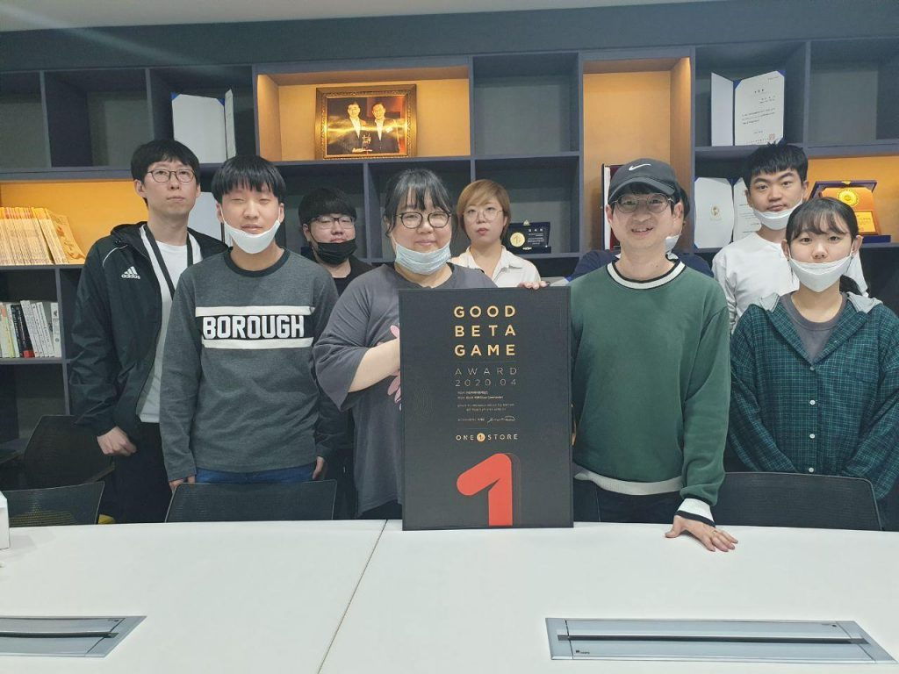

\- 25일까지 14일간 5월 베타게임존 진행

\- 5월 인디게임존 전시작 3종 공개

원스토어㈜(대표: 이재환)은 ㈜와이제이엠게임즈의 ‘라스트 커맨더’를 4월의 우수베타게임으로 선정했다고 밝혔다.

'라스트 커맨더'는 서브컬처 기반의 전략 SLG(시뮬레이션 게임)로, SLG만의 차별화된 전략성과 2D 애니메이션풍의 그래픽이 특징이다. 특히, 다양한 스토리를 가진 보좌관 캐릭터 수집 요소로 재미를 더해 유저들에게 좋은 평가를 받았다.

오진영 ㈜와이제이엠게임즈 사업실장은 "서브컬처 기반의 전략 SLG 타이틀인 라스트 커맨더가 비공개 테스트에서 원스토어 우수베타 게임으로 선정돼 매우 기쁘다”며 “향후 유저들의 소중한 피드백을 반영해 신속하게 정식 출시할 수 있도록 최선을 다하겠다"고 소감을 전했다.

㈜와이제이엠게임즈는 관계사 원이멀스를 통해 VR 게임 개발과 퍼블리싱, VR 카페 사업 등 가상현실 콘텐츠 개발과 투자를 진행하고 있다. 또한 '삼국지블랙라벨’과 ‘삼국지인사이드’ 등 모바일게임 퍼블리싱을 통해 사업영역을 확장하고 있다. 이 밖에 스마트폰과 같은 IT 제품 핵심부품인 진동모터 제조업을 함께 병행하고 있다.

원스토어가 선정한 우수베타게임은 네이버 클라우드, SK C&C의 클라우드 제트를 사용할 경우 게임 출시 전 클라우드 테스트 인프라 비용과 출시 당월과 익월까지 발생한 클라우드 인프라 비용을 무상으로 지원받을 수 있다. 보다 자세한 내용은 원스토어 개발자 센터에서 확인할 수 있다.

원스토어가 지난 12일(화) 공개한 5월 베타게임존은 오늘(25일)까지 진행될 예정이다. 유저가 베타게임존 게임을 다운로드해 플레이 후 설문을 작성하면 게임당 최대 100명에게 원스토어 게임 캐쉬 1만원을 제공한다.

또한, 5월 인디게임존 전시작 3종인 ‘군단택틱스(오자크)’, ‘카드 어드벤처 : 로그 던전(TreeSpider)’, ‘박스헌터(에스엔터테인먼트)’를 전시하며, 전시 기간 동안 해당 게임 다운로드 시 2,000원 상당 보상을 제공한다.
