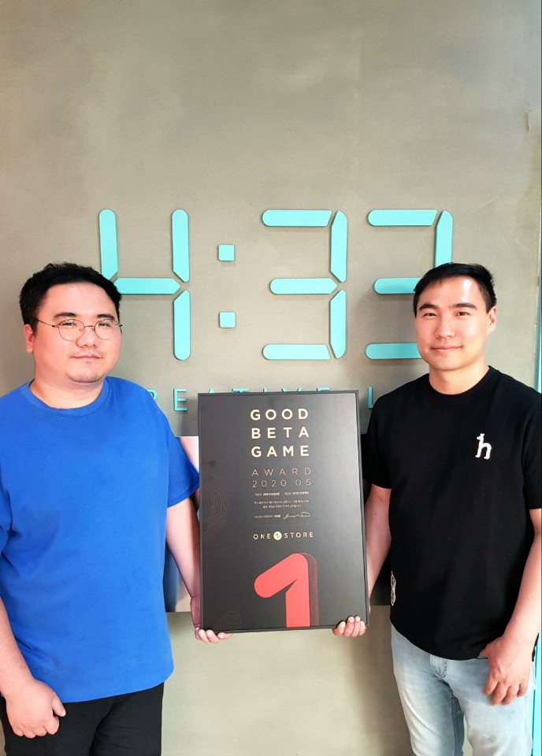

\- 80여종의 매력적인 캐릭터 만날 수 있는 모바일 해전 RPG  
\- 6월 12~25일 ‘베타게임존’ 이벤트 진행...원스토어 게임 캐쉬 증정  
\- 원스토어 내 6월 인디게임존 전시작 3종도 함께 공개

**2020년 06월 12일 -** 게임, 앱, 스토리콘텐츠까지 다양한 모바일콘텐츠를 서비스하는 앱마켓 원스토어㈜(대표 이재환, [www.onestore.co.kr](http://www.onestore.co.kr/))가 ㈜네시삼십삼분의 ‘가디언 프로젝트’를 5월의 우수베타게임으로 선정했다고 밝혔다.

가디언 프로젝트는 지구를 지키기 위해 창조된 인조 생명체 안드로이드의 반란에 맞서 자신만의 함대를 꾸려 세계를 구하는 내용의 실시간 모바일 해전 RPG다. 80종 이상의 매력적인 미소녀 캐릭터를 만날 수 있으며, 이용자 간 전투 콘텐츠(PVP)도 즐길 수 있다. 총 6종의 함선과 자신만의 함선을 꾸밀 수 있는 커스터마이징 시스템 및 흥미진진한 세계관을 바탕으로 한 스토리 모드가 특징이다.

김이석 ㈜네시삼십삼분 사업실장은 “오랫동안 기다려 준 유저들을 실망시키지 않기 위해 긴장과 설렘 속에서 비공개 테스트를 진행했다. 우수베타게임으로 선정돼 매우 기쁘다”며, “이용자들의 소중한 피드백을 바탕으로 게임을 개선하기 위해 더 노력하겠다. 앞으로도 가디언 프로젝트에 많은 관심과 응원 부탁 드린다”고 전했다.

우수베타게임은 개발사들의 수준 높은 콘텐츠 제작을 돕기 위해 원스토어가 진행하는 지원사업이다. 우수베타게임으로 선정되면 네이버 클라우드, SK C&C의 클라우드 제트를 사용할 경우 게임 출시 전 클라우드 테스트 인프라 비용과 출시 당월과 익월까지 발생한 클라우드 인프라 비용을 무상으로 지원받을 수 있다. 보다 자세한 내용은 원스토어 개발자 센터([https://dev.onestore.co.kr](https://dev.onestore.co.kr))에서 확인할 수 있다.

원스토어는 12일(금)부터 25일(목)까지 14일동안 6월 ‘베타게임존’ 이벤트를 진행한다. 원스토어 내 베타게임존 메뉴를 통해 게임을 다운로드해 플레이 후 설문을 작성하면 게임당 최대 100명에게 원스토어 게임 캐쉬 1만원을 제공한다.

또한 6월 원스토어 내 인디게임존에는 3종인 ‘워드트립: 로맨스를 부탁해(이디오크러시)’, ‘B급 갬성, 지블 파이브(심심이)’, ‘양과 늑대(Jinthree Studio)’를 전시하며, 전시 기간 동안 해당 게임 다운로드 시 2,000원 상당 보상을 제공한다.
