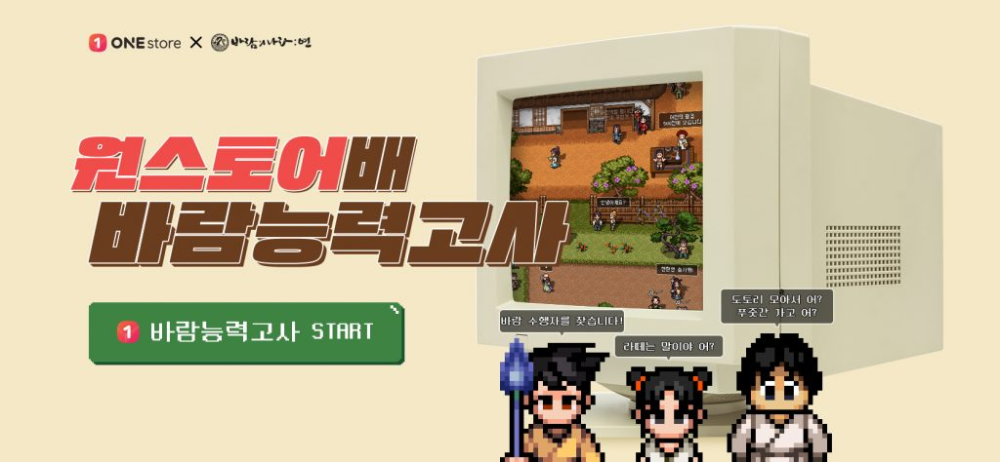

\- 추억 소환하는 바람의나라 퀴즈 이벤트, 순금 1돈 등 풍성한 선물 증정  
\- 원스토어 사전예약 이용자에 20% 독점 할인 쿠폰 제공  
\- 바람의나라 배경음악 활용한 원스토어 광고도 화제 모아

**2020년 06월 18일 -** 게임, 앱, 스토리콘텐츠까지 다양한 모바일콘텐츠를 서비스하는 앱마켓 원스토어㈜(대표 이재환, [www.onestore.co.kr](http://www.onestore.co.kr))가 ‘바람의나라: 연’ 사전예약 오픈을 기념해 ‘원스토어배 바람능력고사’ 이벤트를 진행한다.

17일부터 사전예약에 들어간 바람의나라: 연은 1996년 서비스를 시작해 현재까지도 많은 이들이 즐기고 있는 넥슨의 온라인게임 ‘바람의나라’를 기반으로 제작한 모바일 MMORPG 게임이다. 특유의 조작감과 전투의 묘미를 모바일로 구현해 원작에 추억을 간직한 이들은 물론 누구나 즐길 수 있는 기대작으로 주목 받고 있다.

원스토어배 바람능력고사는 바람의나라에 대한 지식과 애정도인 ‘바람력’을 측정하는 퀴즈 이벤트로 6월 17일부터 8월 초까지 진행된다. 원스토어는 추첨을 통해 게임 참여자 중 총 1천여 명에게 순금 1돈으로 만든 게임 아이템 실물 상품인 ‘노란비서’와 한정판 부채 세트, 원스토어 게임 캐쉬, 치킨 및 아이스크림 모바일교환권 등 푸짐한 경품을 지급한다. 보다 자세한 정보는 원스토어배 바람능력고사 사이트([www.onestorebaramy.com](https://www.onestorebaramy.com/))에서 확인할 수 있다.

원스토어는 바람의나라: 연을 사전 예약하는 이용자를 위해 게임 20% 할인 쿠폰을 통해 최고가 콘텐츠를 1회 할인 구매할 수 있는 특별한 기회를 제공한다. 이 밖에도 공통지급 아이템인 다람이 환수, 5만 금전 등 바람의나라: 연을 즐길 수 있는 유용한 아이템을 선물할 예정이다.

한편, 원스토어는 사전예약 오픈에 맞춰 17일부터 원스토어 브랜드광고 일환으로 바람의나라: 연 을 소재로 한 영상광고를 선보였다. 원스토어 유튜브채널([www.youtube.com/원스토어](http://www.youtube.com/원스토어))에도 공개된 이번 광고는 온라인에서 인기를 끌었던 바람의나라 ‘부여성’ 배경음악을 활용한 익살스런 영상으로 화제를 모으고 있다.

이재환 원스토어 대표는 “바람의나라: 연을 기다리는 이들을 위해 오직 원스토어에서만 받을 수 있는 선물을 풍성하게 준비했다”며, “원작 팬들은 물론 신규 플레이어 모두 다양한 혜택을 제공하는 원스토어에서 바람의나라: 연을 시작하고 즐기길 바란다“ 전했다.
