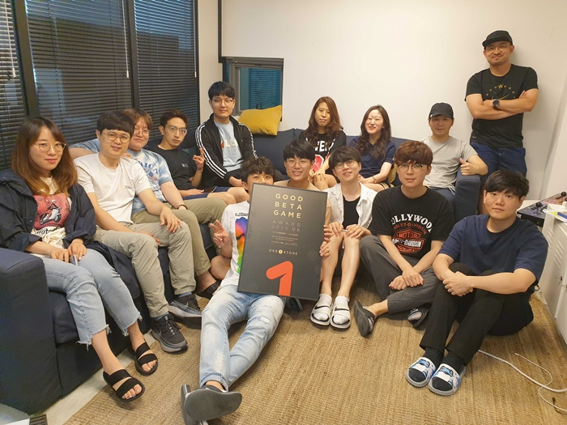

\- 리얼한 그래픽을 바탕으로 플레이 몰입감 높인 모바일 야구 게임  
\- 7월 25일까지 ‘베타게임존’ 이벤트 진행...원스토어 게임 캐쉬 증정  
\- 원스토어 내 7월 인디게임존 전시작 3종 함께 공개

**2020년 07월 16일 -** 게임, 앱, 스토리콘텐츠까지 다양한 모바일콘텐츠를 서비스하는 앱마켓 원스토어㈜(대표 이재환, [www.onestore.co.kr](http://www.onestore.co.kr/))가 ㈜나인엠인터랙티브의 ‘9M프로야구’를 6월의 우수베타게임으로 선정했다고 밝혔다.

이달 선정된 9M프로야구는 KBO 프로야구 라이선스를 기반으로 ‘리얼 야구’를 표방하는 모바일 야구게임이다. 타자와 투수 입장에서 직접 조작하는 플레이 스타일과 리얼한 그래픽을 통해 실제 야구를 하고 있는 듯한 재미를 느낄 수 있는 것이 특징이다.

김성훈 ㈜나인엠인터랙티브 대표는 "야구를 실감나게 표현하기 위해 개발과정 동안 많이 고민하고 노력했다. 이번 베타서비스를 통해 유저분들이 좋아하는 야구 게임 방향을 파악할 수 있는 뜻 깊은 시간이 된 것 같아 기쁘다"며, "향후 피드백을 반영해 미흡한 점을 개선하고, 야구 본연의 재미를 느낄 수 있는 게임으로 거듭나겠다"라고 소감을 전했다.

우수베타게임은 개발사들의 수준 높은 콘텐츠 제작을 돕기 위해 원스토어가 진행하는 지원사업이다. 우수베타게임으로 선정되면 네이버 클라우드, SK C&C의 클라우드 제트를 사용할 경우 게임 출시 전 클라우드 테스트 인프라 비용과 출시 당월과 익월까지 발생한 클라우드 인프라 비용을 무상으로 지원받을 수 있다. 보다 자세한 내용은 원스토어 개발자 센터([https://dev.onestore.co.kr](https://dev.onestore.co.kr))에서 확인할 수 있다.

원스토어는 이달 25일(토)까지 7월 ‘베타게임존’ 이벤트를 진행한다. 원스토어 내 베타게임존 메뉴를 통해 게임을 다운로드해 플레이 후 설문을 작성하면 게임당 최대 100명에게 원스토어 게임 캐쉬 1만원을 제공한다.

또한 7월 원스토어 내 인디게임존에는 전시작 3종인 ‘제기차기(애프터타임)’, ‘루나 : 차원의 감시자(데이브스튜디오)’, ‘구해줘 마이홈(레트로박스)’을 전시하며, 전시 기간 동안 해당 게임 다운로드 시 2,000원 상당 보상을 제공한다.
