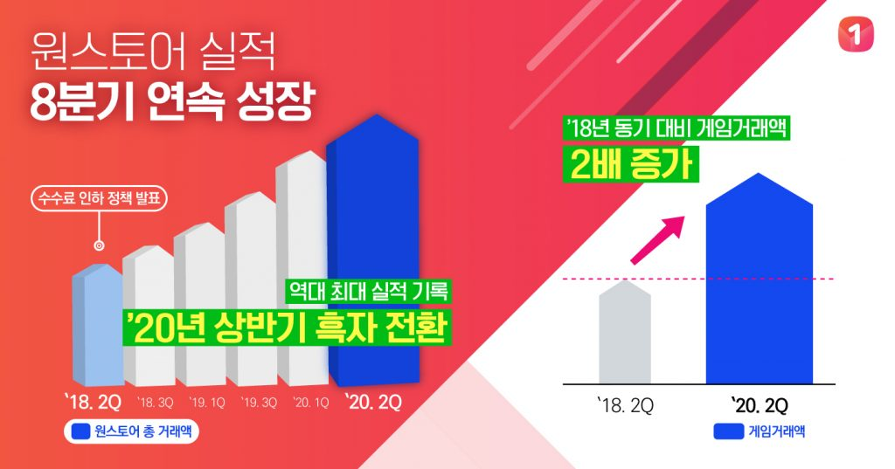

\- 역대 최고 실적 갱신하며 상반기 흑자전환 성공  
\- 게임, 앱, 콘텐츠, 쇼핑 등 주력 4개 분야 모두에서 뚜렷한 성장 기록  
\- 1,000억원 규모 투자 유치 바탕으로 성장에 더욱 박차

**2020년 07월 20일** – 글로벌 앱마켓들의 과도한 수수료 부과가 전세계적인 논란이 되고 있는 가운데, 원스토어가 앱스토어와 개발사 간의 상생 가능성을 증명하고 있다.

게임, 앱, 스토리콘텐츠까지 다양한 모바일콘텐츠를 서비스하는 앱마켓 원스토어㈜(대표 이재환, [www.onestore.co.kr](http://www.onestore.co.kr/))가 2분기에 역대 최고 실적을 갱신하며 2018년 2분기 이후 2년간, 8분기 연속 거래액 성장을 이뤘다고 발표했다.

원스토어는 2018년 2분기 이후 매 분기 사상 최대 실적을 갱신해가고 있으며, 영업 이익 부분에서도 상반기 흑자전환에 성공해 본격적인 성장 궤도에 올라섰다는 평가를 받고 있다.

원스토어는 2018년 7월 개발사와의 상생을 위해 업계에서 불문율로 취급되던 30%의 앱마켓 수수료를 20%로, 자체 결제 시스템을 사용할 경우 5%로 인하하는 파격적인 정책을 시행한 바 있다.

이후 개발사들의 큰 호응 속에 확장을 지속해 왔으며, 지난해에는 모바일 빅데이터 분석기업 아이지에이웍스 모바일인덱스 집계 기준 국내 모바일게임 매출 점유율 12.2%를 기록, 애플 앱스토어를 제치고 2위에 오르며 상생과 성장을 동시에 이뤄내고 있다.

원스토어의 이번 실적은 게임을 비롯해 앱, 콘텐츠, 쇼핑 등 원스토어가 주력하고 있는 4개 분야 모두에서 뚜렷한 성장을 기록했다는 점에서 주목된다.

2분기 원스토어의 게임 거래액은 수수료 인하 전인 2018년 동기 대비 2배 이상 증가했다. 넥슨의 ‘피파 온라인 4M’, 4399코리아의 ‘기적의 검’, 플레이위드의 ‘로한M’, 스마트조이의 ‘라스트오리진’, 엑스엔게임즈의 ‘카오스모바일’ 등 대작 타이틀이 매출을 견인했다. 최근에는 넥슨의 ‘바람의나라: 연’과 선데이토즈의 ‘애니팡4’ 등 국내 대표 게임들도 원스토어에 동시 출시되는 등 수수료 인하 이후 강화되고 있는 원스토어의 위상을 입증하고 있다.

비게임 앱 분야의 거래액도 2018년 2분기 대비 2배 이상 성장했다. 올해 초 코로나19 관련 유용한 앱들을 메인 화면에 배치해 큰 호응을 얻었으며, 각종 온라인 콘텐츠 관련 앱 및 학습 앱, 생활 편리 앱 등이 꾸준한 사랑을 받고 있다.

원스토어 북스로 대표되는 e북 및 웹툰 분야의 성장도 눈에 띈다. 최근 웹툰, 만화, 판타지 및 로맨스 소설까지 무제한으로 이용 가능한 구독형 상품인 ‘북패스’를 선보이며 좋은 반응을 얻고 있으며, 장르 소설과 웹툰의 인기에 힘입어 꾸준한 성장세를 유지하고 있다.

원스토어 쇼핑도 온라인에서 화제를 일으킨 ‘킬러 컨텐츠’를 잇따라 선보이며 높은 거래액을 기록했다. 지난 4월 ‘닌텐도 스위치 동물의 숲 에디션’ 200대를 한정 판매 매진, 5월 ‘플스4 프로 단독 할인 기획전’ 2일만에 준비된 플스 100대 전량 판매에 성공하는 등 게이밍 기어 전문 쇼핑 채널로서의 입지를 확고히 다져가고 있다.

원스토어는 지난해 말 1,000억원 규모의 투자를 유치한 것에 힘입어 사업 확장에 더욱 박차를 가할 계획이다. 게임 분야에서 대작 타이틀을 지속 유치하며 글로벌 앱 마켓과 어깨를 나란히 하는 라인업을 갖추는 것을 목표로 하고 있다. e북 및 웹툰 분야에서도 업계에서 대세로 떠오른 구독형 콘텐츠를 강화하는 한편 타 콘텐츠 유통사와의 제휴를 통해 풍부한 콘텐츠 풀을 확보할 예정이다. 또한 해외 통신사 및 단말 제조사와의 제휴를 통해 시장을 더욱 확대하고 각 지역 유력 기업과 합작회사를 설립해 해외 시장 공략에 직접 나설 계획이다. 한편 원스토어 서비스도 사용자 맞춤형 추천 기능 등 편의성이 대폭 강화된 3.0 버전을 하반기 중 내놓으며 본격적인 사용자 확대에 나설 예정이다.

이재환 원스토어 대표는 “원스토어는 업계와의 상생을 위해 2년 전 단행한 파격적인 수수료 인하 이후 주요 분야에서 2배 이상의 성장을 기록했다”며, “글로벌 앱마켓들의 과도한 수수료가 이슈가 되고 있는 상황에서 상생의 가치를 높게 세우고 우리나라 대표 앱마켓으로서 성장에 박차를 가하겠다”고 언급했다.
