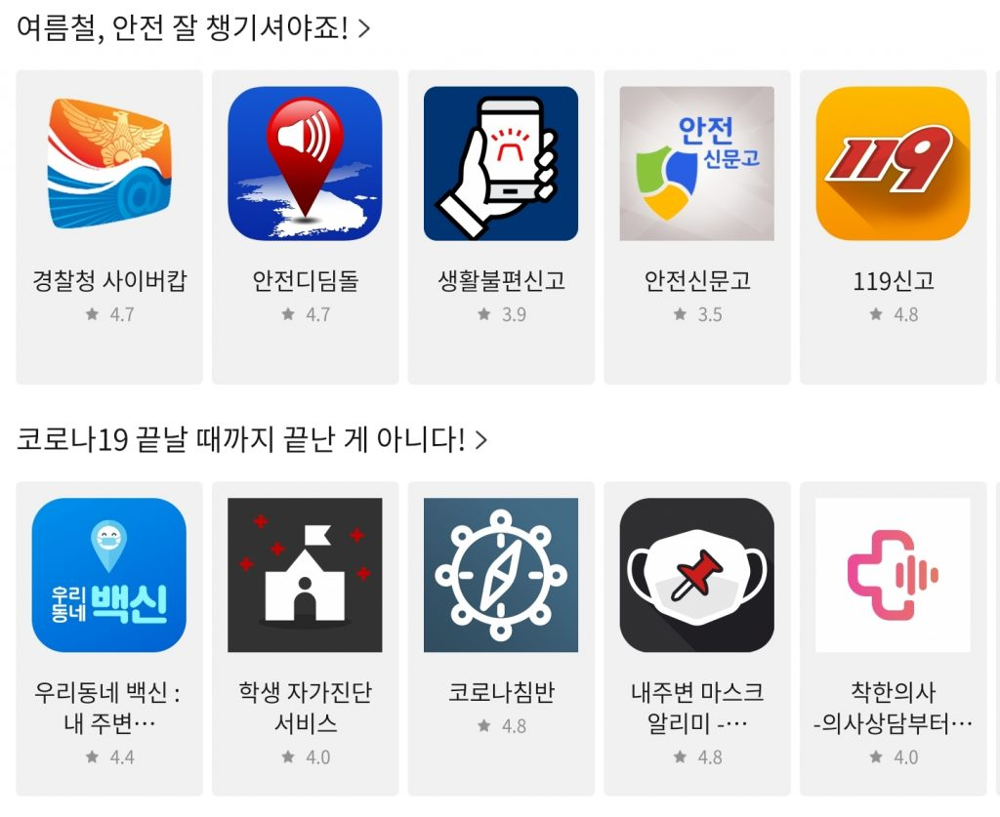

\- 본격적인 휴가 시즌 맞이 여름철 안전 앱 소개  
\- 날씨, 식품 등 여름철 자주 찾는 분야별 구성으로 편리한 검색 가능

**2020년 08월 06일 -** 게임, 앱, 스토리콘텐츠까지 다양한 모바일콘텐츠를 서비스하는 앱마켓 원스토어㈜(대표 이재환, [www.onestore.co.kr](http://www.onestore.co.kr/))가 본격적인 휴가 시즌을 맞아 안전 관련 앱을 소개하는 ‘여름철 안전 캠페인’을 진행한다.

원스토어는 여름철 안전과 관련된 앱 항목을 메인 화면에 구성해 다양한 안전 정보를 편리하게 찾아 볼 수 있도록 모바일 환경을 조성했다. 이번 캠페인을 통해 원스토어 이용자들은 여름철 식품 위생 알림이나 기상예보 등 여름철 안전 앱을 신속하게 검색할 수 있다.

원스토어 앱 메인 화면에는 안전, 식품, 일기예보, 휴가, 코로나19 등 여름 휴가시즌 각 상황 별로 유용하게 사용할 수 있는 앱들이 주제 별로 추천돼 있다.

안전을 주제로 한 ‘여름철, 안전 잘 챙기셔야죠!’ 코너에서는 바닷가를 찾는 여행객들을 위해 해수욕장 안전 유의 정보 등을 제공하는 ‘안전해(海)’, 대피소 정보 및 실시간 재난 알림을 받아볼 수 있는 ‘랜디랑’ 등을 소개한다.

식품 위생을 더욱 유의해야 하는 계절적 특성을 반영해 구성된 ‘여름철, 내가 먹는 식품 안전할까?’에서는 식품 안전 정보를 확인할 수 있는 ‘식품안전나라’, 캠핑이나 휴가지에서 즐겨 먹는 육류에 대한 유통 정보 서비스를 제공하는 ‘축산물 맘편한 서비스’ 등의 식품 안전 앱을 찾아 볼 수 있다.

‘요즘 같은 시기 일기예보는 필수’ 항목에서는 변덕이 심한 여름 날씨에 이용자들이 실시간으로 대응할 수 있도록 실시간 날씨 정보를 제공하는 ‘웨더퐁’, 실시간 날씨 측정 후 그에 맞는 옷차림을 추천해주는 ‘기온별 옷차림’ 등의 앱을 소개한다.

이 밖에도 ‘안전하게 여름 휴가 계획하자’에서는 국내 곳곳의 관광 정보를 한눈에 볼 수 있는 ‘대한민국 구석구석’ 등 여행 관련 앱을 찾아 볼 수 있다. 또한, ‘코로나19 끝날 때까지 끝난 게 아니다!’ 섹션에서는 코로나19 상황판 정보를 실시간으로 볼 수 있는 ‘우리동네 백신’, 코로나 정보 앱 ‘코로나 닥터’ 등을 안내해 이용자들이 휴가 시즌에도 코로나19 감염을 스스로 예방할 수 있도록 돕는다.

한편, 원스토어는 국민 안전을 위해 지난 3월에도 앱 메인 화면에 ‘신종 바이러스, 예방이 최우선’ 섹션을 배치해 코로나19 관련 앱 검색을 강화함으로써 국민들에게 유용한 정보를 발빠르게 전달한 바 있다.
