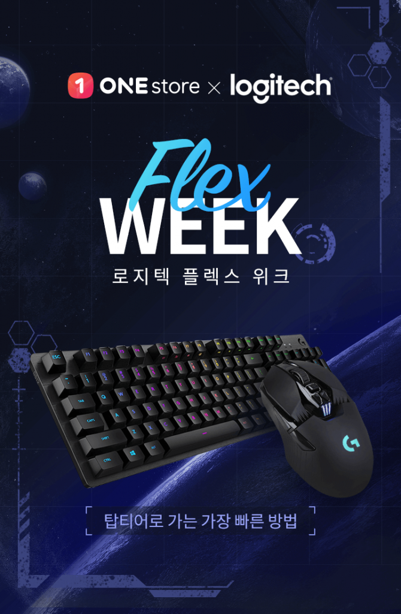

\- 게이머·재택근무자 맞춤 컴퓨터 주변기기 할인 행사, 28일부터 15일간 운영  
\- MX KEYS 키보드와 MX MASTERS3 마우스, 원스토어에서 최초 할인

**2020년 08월 28일 -** 게임, 앱, 스토리콘텐츠까지 다양한 모바일콘텐츠를 서비스하는 앱마켓 원스토어㈜(대표 이재환, [www.onestore.co.kr](http://www.onestore.co.kr))가 28일부터 9월 11일까지 15일간 인기 게이밍 기기 및 사무용 기기를 할인하는 ‘로지텍 플렉스 위크’를 진행한다.

원스토어는 코로나19 여파로 가정에서 게임을 즐기는 게이머들과 재택근무자들에게 더욱 쾌적한 환경을 제공하기 위해 이번 행사를 준비했다. 게임은 물론 다양한 사무용 로지텍의 인기제품을 합리적인 가격에 구매할 수 있다.

원스토어는 PC방에 방문이 어려운 게이머들을 위해 게이밍 마우스 단품과 키보드·마우스 세트 상품 할인을 제공한다. 행사 기간 동안 최대 20% 할인된 가격의 게이밍 마우스 4종을 모델별 200대씩 한정 판매한다. 원스토어가 선정한 키보드·마우스 세트 6종을 한정수량 각 50세트에 한해 최대 20% 할인된 가격에 만나볼 수 있는 특별한 기회도 마련된다.

재택근무자를 위해 로지텍 사무용 기기를 최초로 할인하는 행사도 열린다. 이번에 판매되는 로지텍의 사무용 키보드 MX KEYS와 마우스 MX MASTERS3 세트는 지금까지 공식 할인 행사를 진행한적 없던 제품이다. 이 밖에 K380 키보드와 M350 마우스도 판매될 예정이다.

로지텍 플렉스 위크 기간 동안 원스토어 쇼핑을 방문한 모든 고객은 5만원 이상 구매 시 최대 10% 할인되는 로지텍 브랜드 쿠폰을 다운로드 받을 수 있다. 기본 제공되는 할인율에 10% 쿠폰을 적용할 경우 ‘역대급’ 할인가로 구매가 가능하다. 또한 행사 기간 내 제품 구매 고객에게는 로지텍 10% 할인 쿠폰을 추가 지급하고, 로지텍 로고가 인쇄된 모바일 스트랩도 선물할 예정이다.

한편, 원스토어는 지난 4월 '닌텐도 스위치 모여봐요 동물의 숲 에디션' 한정 판매에 이어 6월 소니 기획전까지 완판 행진을 이어가며 게이밍 기어 전문 쇼핑 채널로서의 면모를 강화해 나가고 있다. 이번 로지텍 플렉스 위크 이후에도 게이밍·콘솔 브랜드와 협업 행사를 주기적으로 진행해 고객들이 필요로 하는 게이밍 기어를 다양한 프로모션과 함께 선보일 예정이다.
